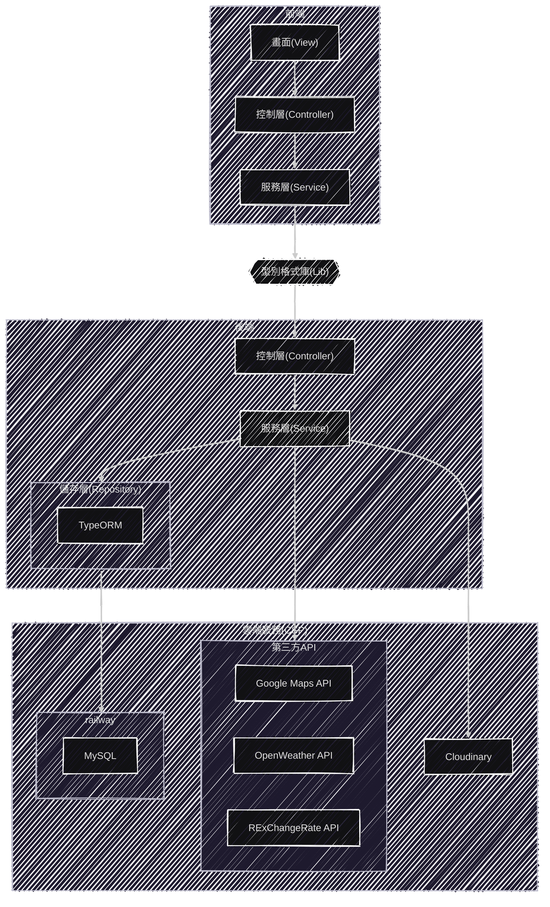

# PinPin網站技術介紹

## 使用技術

### 前端

- Vue3
- TypeScript

#### 前端開發工具

- Vite
- ESLint + Prettier

#### 前端框架生態系

- VueRouter
- Pinia
- Vuetify
- Axios
  
### 後端

- NestJS
- TypeScript

#### 後端資料層

- MySQL
- TypeORM

#### 後端其他技術

- Swagger
- JWT

## 架構

